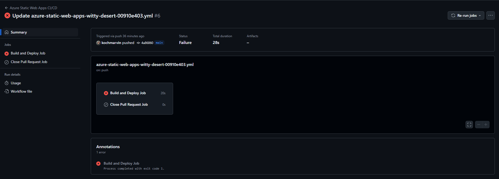
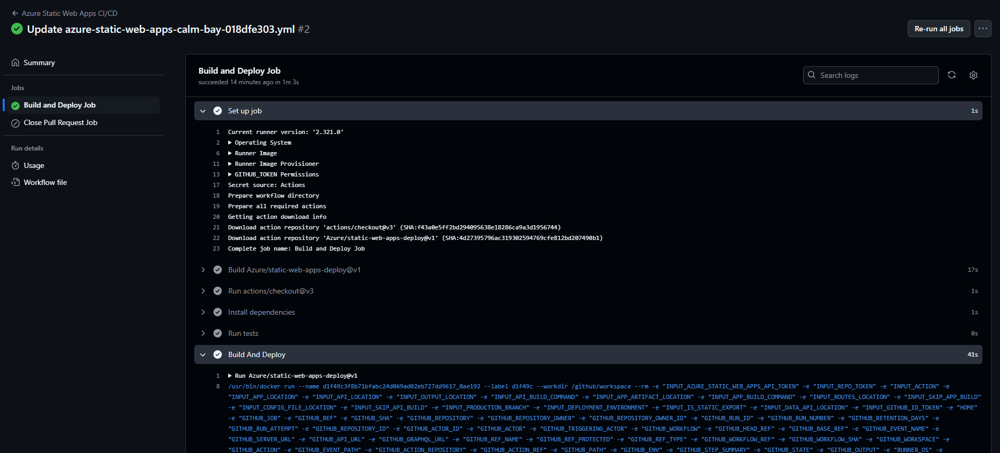
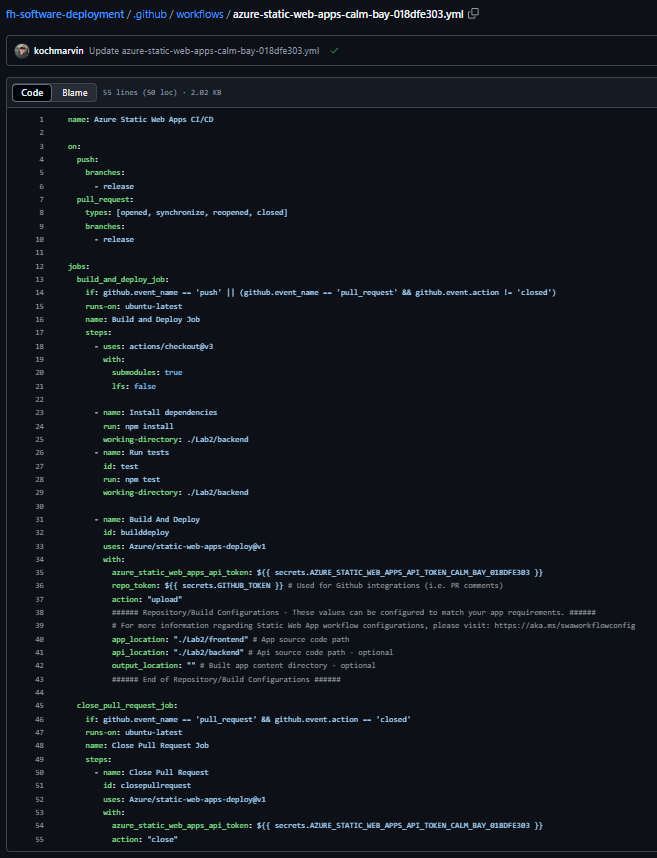

# Github Pipelines

## Links

- Dev-Instance: https://witty-desert-00910e403.5.azurestaticapps.net/api/greeting
- Prod-Instance: https://calm-bay-018dfe303.5.azurestaticapps.net/api/greeting

## Screenshots

### Failed pipeline

### Finished pipeline

### Release workflow

## 3. Release Pipeline Approval

### Step One:
- Open GitHub and navigate to the **Pull Requests** section.

### Step Two:
- Select **release** as the base branch and **main** as the compare branch.

### Step Three:
- Create the pull request, resolve any conflicts, and merge it into the **release** branch.

### Step Four:
- Wait for the static web app to redeploy.
