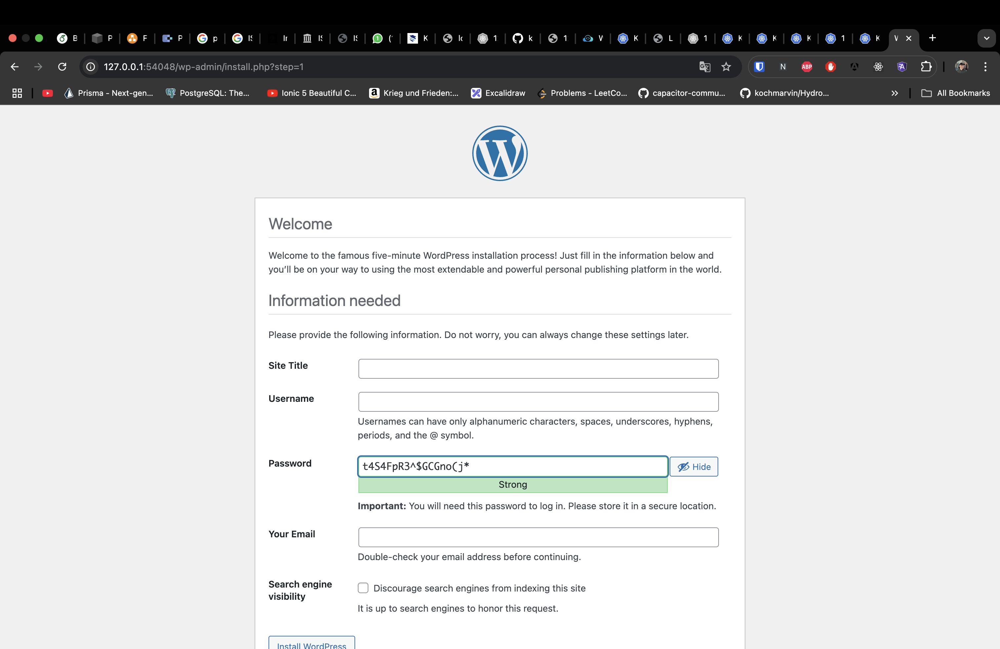

# 

## Prerequisites
> Ensure you have the following installed:
> - Homebrew
> - Docker

## Installation under MacOs

##### Install Kubernetes CLI:
```
brew install kubernetes-cli
```

##### Install Minikube
```
brew install minikube
```

##### Start Minikube
```
minikube start
```

##### Launch Kubernetes Dashboard
```
minikube dashboard
```

## Files

### mysql.yml
> This file defines the MySQL deployment and service configuration, including environment variables for database setup.

### wordpress.yml
>This file defines the WordPress deployment and service configuration. It connects WordPress to the MySQL database using environment variables.

### volumes.yml
> This file contains the definitions for Persistent Volume Claims (PVCs) required by MySQL and WordPress.

## Application

##### Apply Persistent Volumes
```
kubectl apply -f volumes.yml
```

##### Deploy MySQL
```
kubectl apply -f mysql.yml
```

##### Deploy WordPress
```
kubectl apply -f wordpress.yml
```

##### Access WordPress Service
```
minikube service wordpress
```

## Cluster

> Once the deployment is complete, you can access the Kubernetes dashboard to monitor your workloads. The dashboard URL will look similar to:

```
http://127.0.0.1:53928/api/v1/namespaces/kubernetes-dashboard/services/http:kubernetes-dashboard:/proxy/#/workloads?namespace=default
```


